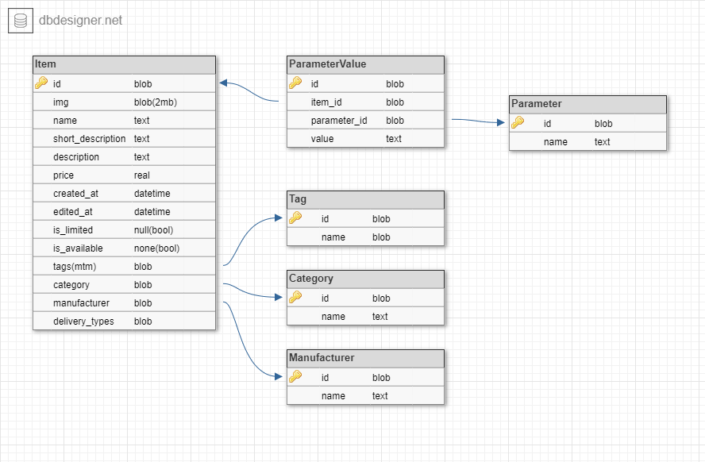

# Marketplace MEGANO backend project

## Setup

```
(env)$ pip install -r requirements.txt
```

---
[optional] for Postgresql:

- comment sqlite section in settings.py
- --- AND ---
- put docs/.my_pgpass.conf and docs/.pg_service.conf into %appdata%/postgresql/
- uncomment postgresql-options section in settings.py
- --- OR ---
- uncomment postgresql section 
---

```
(env)$ py manage.py migrate
(env)$ py manage.py loaddata test_users.json test_catalog.json
```


```
(env)$ py manage.py runserver
```

On server start applies config.cfg parameters as dynamic settings

| **Login**       | **Pass** |
|-----------------|----------|
| admin           | 123      |
| Test_user       | 123456   |
| Test_user_1     | 123456   |
| Test_user_admin | 123456   |

 
 


## Project structure

### Database structure
Models implemented:
- User
- Profile
- Cart
- CartPosition
- Item
- Commentary
- PurchaseHistory
- OrderInstance
- PaymentStatus
- PaymentType
- DeliveryType
- Category
- Manufacturer

// Поправить таблицы: cart -> user, discount




### Paths structure
| **Section** | **Page**          | **Description**                                                    | **HTTP-method** | **URL**                   | **Commentary**                                   |
|:------------|:------------------|:-------------------------------------------------------------------|:---------------:|:--------------------------|:-------------------------------------------------|
| Root        | Main page         |                                                                    |       Get       | /                         | Includes categories, offers etc.                 |
| Catalog     | Item list         | ListView with Item model                                           |       Get       | /catalog/                 |                                                  |
| Catalog     | Item page         | DetailView with Item model                                         |       Get       | /catalog/<:pk>/           |                                                  |
| Catalog     | Item page         | Adding commentary                                                  |      Post       | /catalog/<:pk>/           |                                                  |
| Catalog     | Item page         | Adding to cart                                                     |      Post       | /catalog/<:pk>/           |                                                  |
| Cart        | Cart              | Cart with all added items                                          |       Get       | /cart/                    |                                                  |
| Cart        | Cart              | Removing Position from cart                                        |      Post       | /cart/                    | {'delete': <position_id>}                        |
| Cart        | Cart              | Changing Position amount                                           |      Post       | /cart/                    | {'add': <position_id>} or {'sub': <position_id>} |
| Order       | Order form        | Giving form needed for make order                                  |       Get       | /cart/order/              | Fields are autofilled in case of authorized user |
| Order       | Order form        | Sending form fields to server                                      |      Post       | /cart/order/              | Redirects to ./delivery                          |
| Order       | Delivery form     | Giving form for choosing deliver type                              |       Get       | /cart/order/delivery/     |                                                  |
| Order       | Delivery form     | Sending form fields to server                                      |      Post       | /cart/order/delivery/     | Redirects to ./paymenttype                       |
| Order       | Payment type form | Giving form for choosing payment type                              |       Get       | /cart/order/paymenttype/  |                                                  |
| Order       | Payment type form | Sending form fields to server                                      |      Post       | /cart/order/paymenttype/  | Redirects to ./paymenttype                       |
| Order       | Confirmation      | Shows resulting info about user order                              |       Get       | /cart/order/confirmation/ |                                                  |
| Order       | Confirmation      | Confirms order details                                             |      Post       | /cart/order/confirmation/ | Redirects to ./payment                           |
| Order       | Payment form      | User enters card number or uses generator (depends on pay.type)    |       Get       | /cart/order/payment/      |                                                  |
| Order       | Payment form      | Sensing form to server to validate it                              |      Post       | /cart/order/payment/      | Sends HttpResponse afterwards                    |
| Cabinet     | Personal cabinet  | Contains comprehensive info about user's profile and last purchase |       Get       | /cabinet/                 |                                                  |
| Cabinet     | Profile           | Page allowing editing of user's profile info                       |       Get       | /cabinet/profile/         |                                                  |
| Cabinet     | Profile           | Request for editing profile                                        |      Post       | /cabinet/profile/         |                                                  |
| Cabinet     | Purchase history  | ListView with PurchaseHistory model                                |       Get       | /cabinet/purchases/       |                                                  |
| Cabinet     | Purchase history  | DetailView with PurchaseHistory model                              |       Get       | /cabinet/purchases/<:pk>/ | Contains immutable fields and full order info    |
| Cabinet     | Purchase history  | Sends through order sequence again (starting with payment type)    |      Post       | /cabinet/purchases/<:pk>/ |                                                  |
| Users       | Register          | Giving form needed for register user                               |       Get       | /users/register/          |                                                  |
| Users       | Register          | Sending form fields to server                                      |      Post       | /users/register/          |                                                  |
| Users       | Login             | Authenticating and login user                                      |       Get       | /users/login/             |                                                  |
| Users       | Logout            | Logout user                                                        |       Get       | /users/logout/            |                                                  |
| Admin panel |                   | Everything included in django administrating panel                 |       Get       | /admin/                   | Admin rights are required                        |